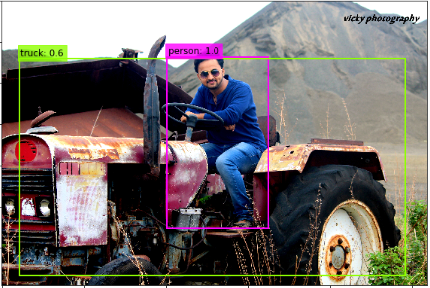

# YOLO-Object-Detection

## Problem Statement:
To detect the objects from a given input image or sequences of images from a video using **YOLO Object Detection Algorithm.** 

YOLO stands for **You Only Look Once**. It is a state-of-the-art, real-time object detection algorithm. YOLO uses **Darknet**, an open source, deep neural network framework written by the creators of YOLO

**INPUT IMAGE**

**OUTPUT IMAGE**

## Importing Resources
* `OpenCV` is used to load the images.
* `matplotlib` is used to plot/show the images.
* `utils.py` module contains some helper functions.
* `darknet.py` module contains the **darknet** architechture which is used by the **YOLO algorithm.**

## Important Files 
* `yolov3.cfg` file contains the network architecture used by YOLOv3 and placed it in the `/cfg/` folder. 
* `yolov3.weights` file contains the weights of pre-trained model and is placed in the `/weights/` directory. You can easily download the weights using the link https://pjreddie.com/darknet/yolo/
* `coco.names` file contains the list of the 80 object classes that the weights were trained to detect and is placed in the `/data/` directory.

## Model Loading and Object Detection.
Here we are loading the **darknet** architecture with **pretrained weights**.

Once the image has been loaded and resized, and have chosen your parameters for `nms_thresh` and `iou_thresh`, we can use the YOLO algorithm to detect objects in the image. We detect the objects using the `detect_objects(m, resized_image, iou_thresh, nms_thresh)`function from the `utils` module. This function takes in the model `m` returned by *Darknet*, the resized image, and the NMS and IOU thresholds, and returns the bounding boxes of the objects found.

Each bounding box contains 7 parameters: the coordinates *(x, y)* of the center of the bounding box, the width *w* and height *h* of the bounding box, the confidence detection level, the object class probability, and the object class id. 

Finally, we use the `plot_boxes()` function to plot the bounding boxes and corresponding object class labels found by YOLO in our image. The `plot_boxes()`function uses the same color to plot the bounding boxes of the same object class.

YOLO algorithm uses **Intersection over Union(IoU)** and **Non Maximum supression** to find the objects and with best bounding box.

## Intersection over Union(IoU) Values
The IoU between two bounding boxes will always have a value between 0 and 1 because, as two boxes drift apart, their intersection approaches 0, but if two bounding boxes overlap perfectly their IoU will be 1.

So, the higher the IOU the more overlap there is between the two bounding boxes!

## Non-Maximal Suppression
Non-maximal Suppression is implemented in a few steps.

1. Look at the output vector of each grid cell. Each grid cell will have an output vector with a **Pc** value and bounding box coordinates.
2. Remove all bounding boxes that have a Pc value less than or equal to some threshold, say 0.5. Therefore, we will only keep a bounding box, if there is more than a 50% chance of an object being inside of it.
3. Select the bounding box with the highest Pc value.
4. Remove all the bounding boxes that have a high IoU* with the box selected in the last step.
A high IoU usually means a that the IoU is greater than or equal to 0.5.

## References and links
* YOLO https://pjreddie.com/darknet/yolo/
* Udacity https://github.com/udacity/CVND_Exercises/tree/master/2_2_YOLO
